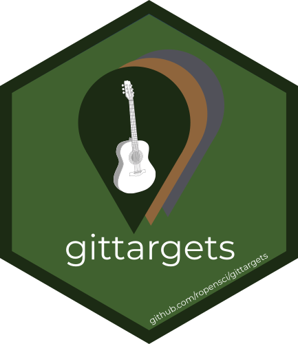

```{r, include = FALSE}
knitr::opts_chunk$set(
  collapse = TRUE,
  comment = "#>",
  fig.path = "man/figures/README-",
  out.width = "100%"
)
```

# gittargets 

[](https://CRAN.R-project.org/package=gittargets)
[](https://www.repostatus.org/#wip)
[](https://github.com/wlandau/gittargets/actions?query=workflow%3Acheck)
[](https://codecov.io/gh/wlandau/gittargets)
[](https://github.com/wlandau/gittargets/actions?query=workflow%3Alint)

Version control systems such as Git help researchers track changes and history in data science projects, and the [`targets`](https://docs.ropensci.org/targets/) package minimizes the computational cost of keeping the latest results reproducible and up to date. The `gittargets` package combines these two capabilities. The [`targets`](https://docs.ropensci.org/targets/) data store becomes a version control repository and stays synchronized with the Git repository of the source code. Users can switch commits and branches without invalidating the [`targets`](https://docs.ropensci.org/targets/) pipeline.

## Prerequisites

1. Familiarity with the [R programming language](https://www.r-project.org/), covered in [R for Data Science](https://r4ds.had.co.nz/).
1. [Data science workflow management best practices](https://rstats.wtf/index.html).
1. [Git](https://git-scm.com), covered in [Happy Git and GitHub for the useR](https://happygitwithr.com).
1. [`targets`](https://docs.ropensci.org/targets/), which has resources on the [documentation website](https://docs.ropensci.org/targets/#how-to-get-started).

## Installation

Type | Source | Command
---|---|---
Release | CRAN | Not yet published.
Development | GitHub | `remotes::install_github("wlandau/gittargets")`

## How it works


### Development

When you develop a reproducible analysis project, you write R code, run the pipeline, commit the code to a branch, and repeat. `gittargets` enters the picture at the end of each one of these development cycles. When the code files are up to date in the Git repository and the targets are up to date in the pipeline, `gittargets` can snapshot the [`targets` data store](https://books.ropensci.org/targets/files.html#internal-data-files) to a local version control repository of its own. Each data snapshot is a Git commit and a one-time Git branch. The branch associates the data commit with the code commit that was checked out when the snapshot was created. This one-to-one code-data mapping facilitates transitions.

### Transitions

To reproducibly track alternative versions of your project, it is good practice to create multiple Git commits and Git branches for your R code during development. That way, you can transition among multiple versions of your code with [`git checkout`](https://git-scm.com/docs/git-checkout). But your code commits probably do not contain the [`targets` data store](https://books.ropensci.org/targets/files.html#internal-data-files) because it is too big to fit on [GitHub](https://github.com). If so, switching to a different branch will most likely invalidate the [`targets`](https://docs.ropensci.org/targets/) pipeline, causing you to rerun hours of computation you should not have to run. But with `gittargets`, once you check out a branch in the code, you can also check out the corresponding snapshot of the [data store](https://books.ropensci.org/targets/files.html#internal-data-files). If you check out both the code commit and its matching data snapshot, then you will restore your old targets and they will all be up to date.

## Performance

Every data snapshot with `tar_git_snapshot()` creates a new Git branch. With thousands of commits and thus thousands of branches, performance may suffer. If you notice slowness, run [`git pack-refs --all`](https://git-scm.com/docs/git-pack-refs) on the [`targets` data store](https://books.ropensci.org/targets/files.html#internal-data-files) repository.

## Future directions

The first data versioning system in `gittargets` uses [Git](https://git-scm.com), which is designed for source code and may not scale to enormous amounts of compressed data. Future releases of `gittargets` may explore other potential data backends such as [`git-annex`](https://git-annex.branchable.com) and [DVC](https://dvc.org).

## Code of Conduct

Please note that the `gittargets` project is released with a [Contributor Code of Conduct](https://contributor-covenant.org/version/2/0/CODE_OF_CONDUCT.html). By contributing to this project, you agree to abide by its terms.

## Citation

```{r, warning = FALSE}
citation("gittargets")
```
