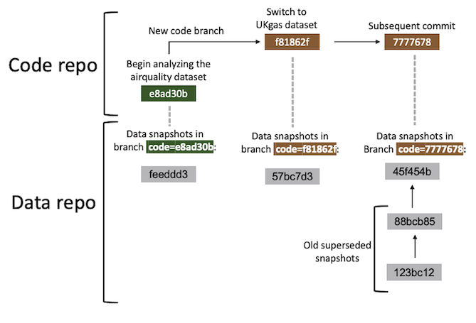

```{r setup, include = FALSE}
library(gert)
library(gittargets)
library(targets)
tmp <- tempfile()
dir.create(tmp)
knitr::opts_knit$set(root.dir = tmp)
knitr::opts_chunk$set(
  collapse = TRUE,
  comment = "#>",
  eval = identical(Sys.getenv("NOT_CRAN"), "true") &&
    tar_git_ok(verbose = FALSE)
)
```

This tutorial shows how to use `gittargets` with the Git-based data versioning backend. Before proceeding, please read the [README](https://github.com/ropensci/gittargets/blob/main/README.md) file or [documentation website front page](https://docs.ropensci.org/gittargets/) for an overview of the package.

## Installation

Please begin with the installation instructions on the [documentation website](https://docs.ropensci.org/gittargets/). In addition, if your `targets` pipeline generates large data files, consider installing [Git LFS](https://git-lfs.github.com). The Git data backend in `gittargets` automatically opts into [Git LFS](https://git-lfs.github.com), so you should not need to do any manual configuration to reap the performance benefits.

## Remotes

This backend is uses local [Git](https://git-scm.com) only. It is possible to push the snapshotted [data store](https://books.ropensci.org/targets/data.html) to a cloud service like [GitHub](https://github.com), [GitLab](https://about.gitlab.com), or [Bitbucket](https://bitbucket.org), but this is the user's responsibility. Pipelines usually generate large data files, and [GitHub](https://github.com) and its peers have file size limitations. Also, `gittargets` automatically opts into [Git LFS](https://git-lfs.github.com) locally (unless `git_lfs` is `FALSE` in `tar_git_init()`), and [Git LFS](https://git-lfs.github.com) on the cloud is a paid service.

## Overall workflow

The most important steps of the Git data backend are as follows. The rest of this vignette walks through these steps in greater depth.

1. Create the source code and run the pipeline at least once so the [data store](https://books.ropensci.org/targets/data.html) exists.
1. `tar_git_init()`: initialize a [Git](https://git-scm.com)/[Git-LFS](https://git-lfs.github.com) repository for the [data store](https://books.ropensci.org/targets/data.html).
1. Bring the pipeline up to date (e.g. with [`tar_make()`](https://docs.ropensci.org/targets/reference/tar_make.html)) and commit any changes to the source code.
1. `tar_git_snapshot()`: create a data snapshot for the current code commit.
1. Develop the pipeline. Creating new code commits and code branches early and often, and create data snapshots at key strategic milestones.
1. `tar_git_checkout()`: revert the data to the appropriate prior snapshot.

## Create code

To begin development, we write `_targets.R` file for a [`targets`](https://docs.ropensci.org/targets/) pipeline. [`targets`](https://docs.ropensci.org/targets/) can handle large complex pipelines for [machine learning](https://github.com/wlandau/targets-keras), [Bayesian data analysis](https://github.com/wlandau/rmedicine2021-pipeline), and much more. However, this tutorial focuses on a much simpler pipeline for the sake of pedagogical simplicity.

```{r, eval = FALSE}
# _targets.R
library(targets)
list(
  tar_target(data, datasets::airquality),
  tar_target(result, summary(data))
)
```

```{r, echo = FALSE}
tar_script(
  list(
    tar_target(data, datasets::airquality),
    tar_target(result, summary(data))
  )
)
```

## Run pipeline

With our target script in hand, we run the pipeline.^[<https://books.ropensci.org/targets/hpc.html> describes heavy-duty alternatives to `tar_make()`.]

```{r}
tar_make()
```

We inspect the output with `tar_read()`.

```{r}
tar_read(result)
```

## Commit code

We usually iterate between writing code and running the pipeline until we have a decent set of results. After that, we commit the code to a [Git](https://git-scm.com/docs/git-pack-refs) repository, which may or may not live on [GitHub](https://github.com).^[Alternatives to GitHub include GitLab and Bitbucket.] [Happy Git with R](https://happygitwithr.com) is a great way to learn Git, and the [`gert`](https://docs.ropensci.org/gert/) package is a convenient way to interact with Git from R.

```{r, message = FALSE, output = FALSE, results = "hide"}
library(gert)
git_init()
git_add("_targets.R")
git_commit("Begin analyzing the airquality dataset")
git_branch_create("airquality")
```

## Snapshot data

Before we snapshot the data, we should check that the code is up to date in the Git repository and the targets are up to date in the pipeline. The `tar_git_status()` function is an easy way to do this.^[Helper functions `tar_git_status_code()`, `tar_git_status_targets()`, and `tar_git_status_data()` each generate a piece of the `tar_git_status()` output.]

```{r}
tar_git_status()
```

Our code and pipeline look ready for a data snapshot. First, we initialize the data repository with `tar_git_init()`. `tar_git_init()` writes a `.gitattributes` file in the data store that automatically opts into [Git LFS](https://git-lfs.github.com). If you have [Git LFS](https://git-lfs.github.com) but do not wish to use it, please remove the `.gitattributes` after calling `tar_git_init()`.

```{r}
tar_git_init()
```

Then, we create our first data commit with `tar_git_snapshot()`.^[Ordinarily, `tar_git_snapshot()` shows runs `tar_git_status()` and prompts the user to confirm the snapshot. But in this example, we skip this step.]

```{r, eval = FALSE}
tar_git_snapshot()
```

```{r, echo = FALSE}
tar_git_snapshot(status = FALSE)
```

### Snapshot model



In the Git data backend, a data snapshot is a special kind of Git commit (gray boxes above). Each data commit is part of a data branch (vertical dashed lines above), and each data branch is specific to the current code commit (green and brown boxes above). In fact, each data branch name is of the form `"code=<SHA1>"`, where `<SHA1>` is the Git SHA1 hash of the corresponding code commit. You can always create a data snapshot, but it will supersede any prior data snapshot you already have for the current code commit. To revert to a previous data snapshots for a given code snapshot, you will need to manually enter the repository and check out the relevant data commit.

## Repeat

Development typically happens in cycles: develop the code, run the pipeline, commit the code, snapshot the data, and repeat. Not all code commits need a data snapshot, especially if the [`targets`](https://docs.ropensci.org/targets/) pipeline generates a lot of data. But even then, it is helpful to snapshot the data at key milestones, e.g. if an alternative research question comes up and it is desirable to create a new Git branch for the code. For example, suppose we wish to apply the same pipeline to a different dataset. The code changes:

```{r, eval = FALSE}
# _targets.R
library(targets)
list(
  tar_target(data, datasets::UKgas), # different dataset
  tar_target(result, summary(data))
)
```

```{r, echo = FALSE}
tar_script(
  list(
    tar_target(data, datasets::UKgas),
    tar_target(result, summary(data))
  )
)
```

We run the pipeline and inspect the new output.

```{r}
tar_make()
```

```{r}
tar_read(result)
```

We put the code in a new Git branch.

```{r}
git_branch_create("UKgas")
git_add("_targets.R")
git_commit("Switch to UKgas dataset")
```

Finally, we create a data snapshot for the new code commit.

```{r, eval = FALSE}
tar_git_snapshot()
```

```{r, echo = FALSE}
tar_git_snapshot(status = FALSE)
```

## View log

Now, suppose we want to switch the project back to the original dataset (`airquality`). To transition completely, we need to revert both the code and the data. If we only revert the code, then the data store will sill reflect the `UKgas` dataset, and none of our targets will be up to date. At this point, it is a good time to pause and check the `gittargets` log to see which code commits have available data snapshots.^[If you chose not to call `tar_git_snapshot()` for some code commits, then not all your code commits will have available data snapshots.]

```{r}
tar_git_log()
```

## Check out code

To check out the old `airquality` code, we use `gert::git_branch_checkout()`.

```{r, message = FALSE, output = FALSE, results = "hide"}
git_branch_checkout("airquality")
```

But because we did not revert the data, our results still reflect the `UKgas` dataset.

```{r}
tar_read(result)
```

Thus, all our targets are out of date.

```{r}
tar_outdated()
```

## Check out data

To bring our targets back up to date with the `airquality` data, instead of beginning a potentially long computation with `tar_make()`, we can check out the data snapshot that matches our current code commit.

```{r}
tar_git_checkout()
```

Now, our results reflect the `airquality` dataset we previously analyzed.

```{r}
tar_read(result)
```

And all our targets are up to date.

```{r}
tar_outdated()
```

## Merges

It is common to [merge](https://git-scm.com/docs/git-merge) code branches into one another. When this happens, a new merge commit is created in the code repository, and the data repository remains unchanged. In fact, the only change is that the code repository is now at a new commit that has no data snapshot yet. If you wish, simply create a new data snapshot with `tar_git_snapshot()`. If the code commit immediately prior had an up-to-date data snapshot of its own, then the new snapshot for the merge commit should cost little storage or runtime.

## Custom data files

Only files inside the `targets` data store are tracked in a `gittargets` data snapshot. If your pipeline requires custom external files, you may put them in a folder called `_targets/user/`. That way, `gittargets` will automatically put them under data version control in the next snapshot.

## Performance

If your `targets` pipeline generates large data files, consider installing [Git LFS](https://git-lfs.github.com). Once you install [Git LFS](https://git-lfs.github.com), it should just work on your project right out of the box because `tar_git_init()` writes the following to `_targets/.gitattributes`:

```{sh, eval = FALSE}
objects filter=lfs diff=lfs merge=lfs -text
```

In addition, every data snapshot with `tar_git_snapshot()` creates a new Git branch. With thousands of commits and thus thousands of branches, performance may suffer unless you ensure `pack_refs` is `TRUE` in the function call (default).^[Alternatively, you can call `tar_git_snapshot(pack_refs = FALSE)` and then afterwards run `git pack-refs --all`](https://git-scm.com/docs/git-pack-refs) in the command line with your working directory inside `_targets/`.]
